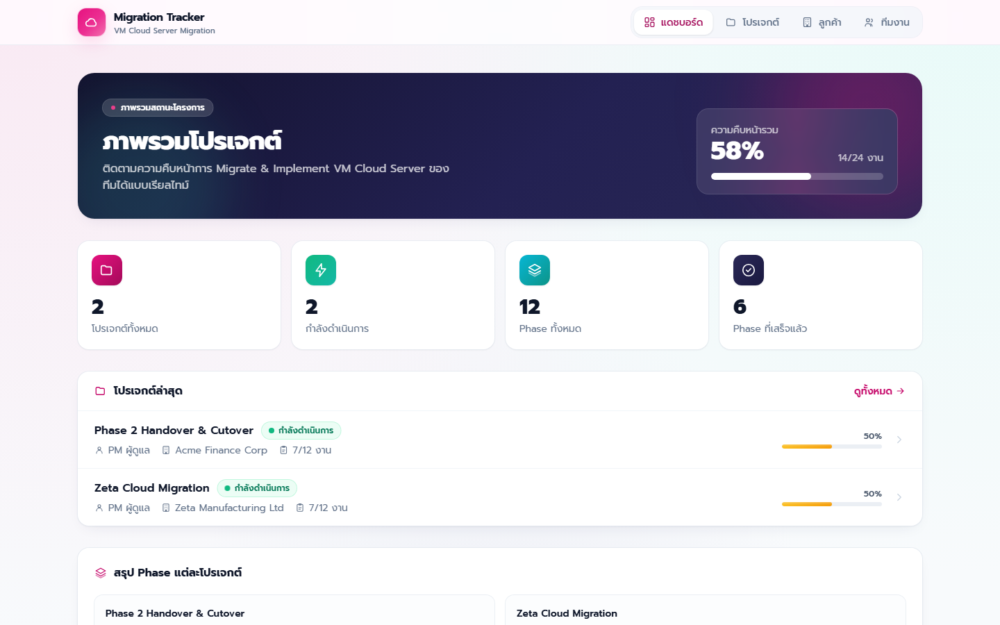
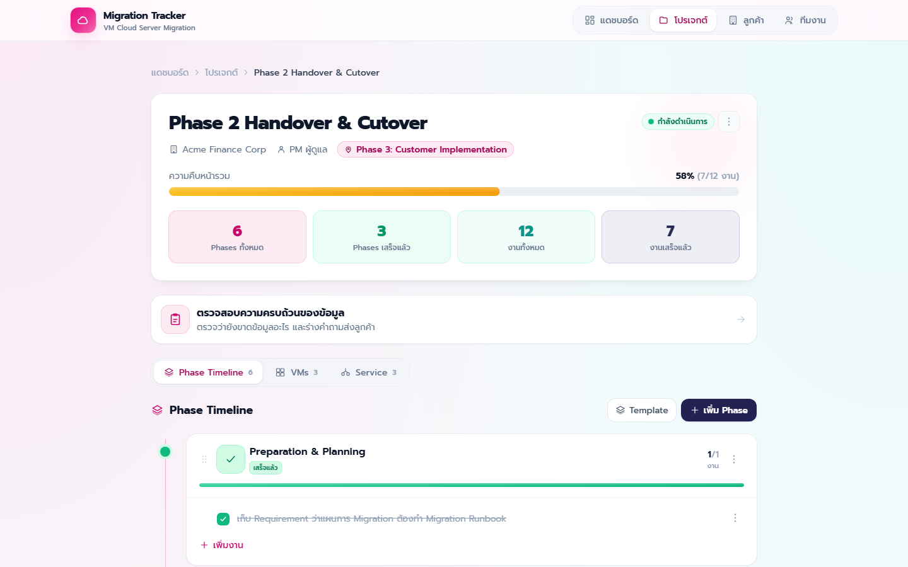
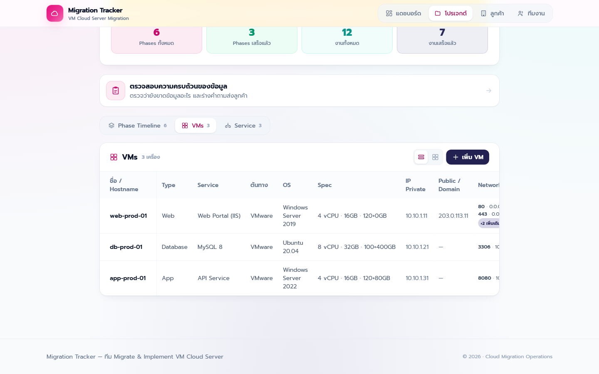
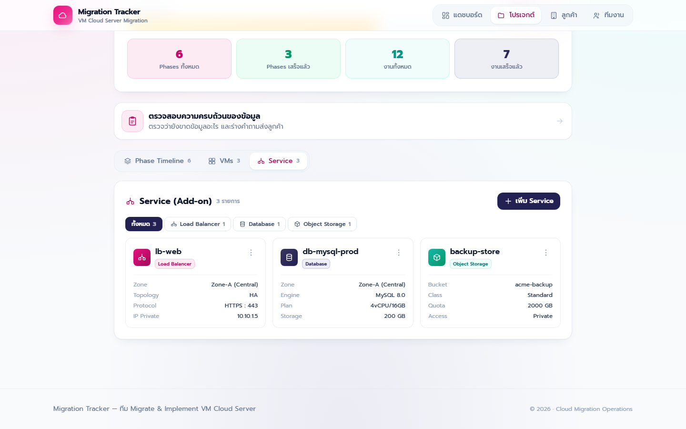
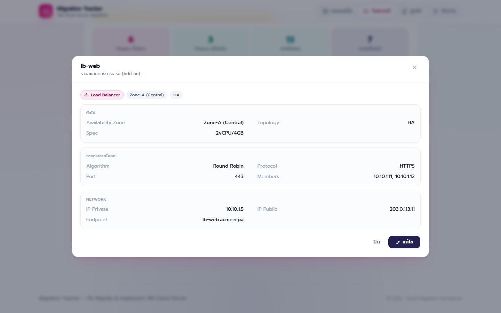
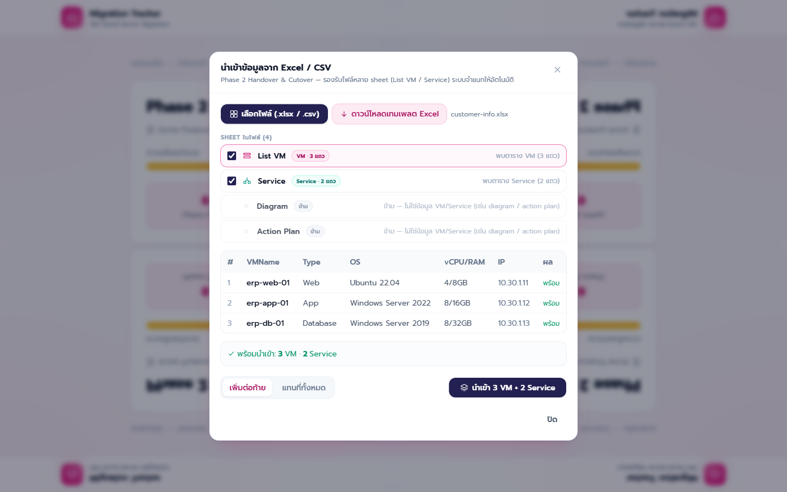
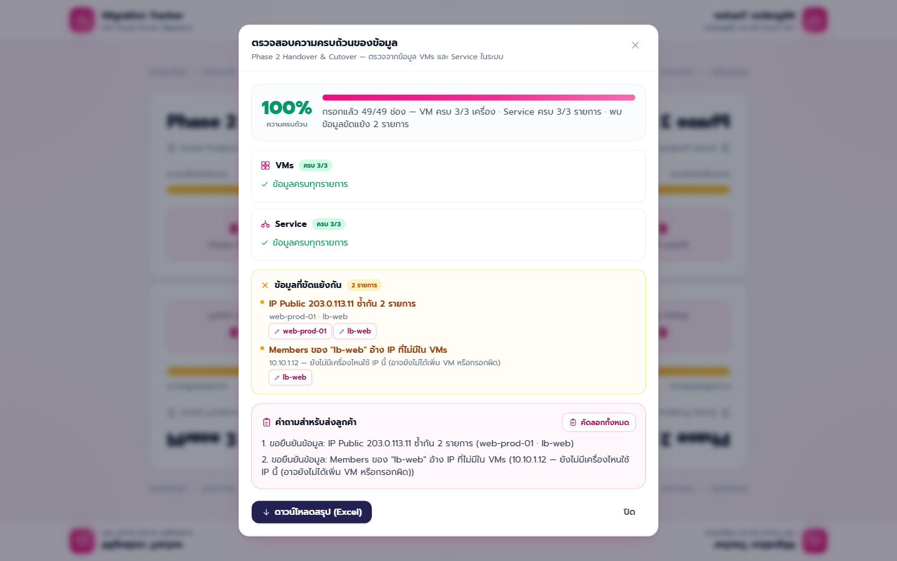
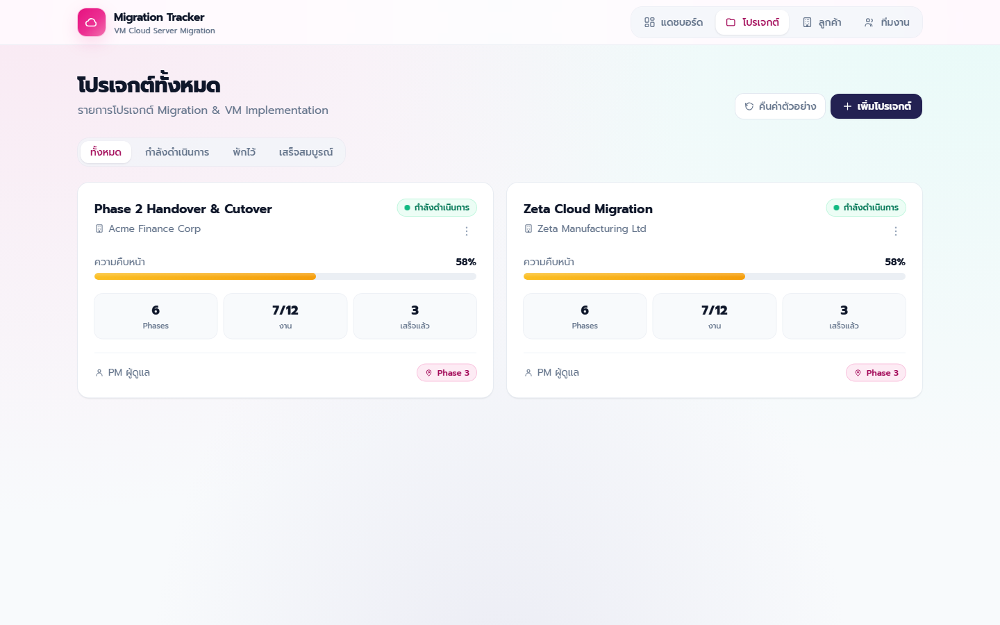

# Migration Tracker

เว็บติดตามงาน **Migration ของ VM ขึ้น NIPA Cloud** สำหรับทีม Migrate & Implement — รวมแผนงานรายเฟส,
inventory ของเครื่องที่ต้องย้าย, บริการเสริม (Load Balancer / Database / Object Storage)
และตัวตรวจสอบว่าข้อมูลที่ได้จากลูกค้าครบพอจะเริ่ม migrate หรือยัง ไว้ในที่เดียว

เก็บข้อมูลใน **SQLite** ผ่าน backend ตัวเล็ก ๆ (Express) — เป็นไฟล์เดียวไม่ต้องติดตั้ง DB server
ทุกคนที่ชี้มา backend ตัวเดียวกันจึงเห็นข้อมูลชุดเดียวกัน



---

## สารบัญ

- [เริ่มต้นใช้งาน](#เริ่มต้นใช้งาน)
- [ฟีเจอร์](#ฟีเจอร์)
- [โครงสร้างโค้ด](#โครงสร้างโค้ด)
- [โมเดลข้อมูล](#โมเดลข้อมูล)
- [ฟีเจอร์ AI (ออปชัน)](#ฟีเจอร์-ai-ออปชัน)
- [หมายเหตุ](#หมายเหตุ)

---

## เริ่มต้นใช้งาน

ต้องมี **Node.js 18 ขึ้นไป**

```bash
npm install
npm run dev:all
```

เปิด <http://localhost:3000>

> ⚠️ ต้องใช้ `dev:all` — มันรันทั้ง frontend และ backend
> ถ้ารันแค่ `npm run dev` แอปจะเปิดขึ้นมาแต่โหลดข้อมูลไม่ได้ เพราะ API ไม่ทำงาน

| คำสั่ง | ทำอะไร |
|---|---|
| `npm run dev:all` | **ใช้ตัวนี้ตอนพัฒนา** — รัน frontend + backend พร้อมกัน |
| `npm run dev` | รันเฉพาะ frontend (Vite) พอร์ต 3000 — ต้องมี backend รันคู่ด้วย |
| `npm run server` | รันเฉพาะ backend (Express) พอร์ต 8787 — เสิร์ฟ API ข้อมูลและ AI |
| `npm run build` | ตรวจ type ด้วย `tsc -b` แล้ว build ลง `dist/` |
| `npm run preview` | เปิดดูผลลัพธ์ที่ build แล้ว |

ครั้งแรกที่รัน backend จะสร้าง**บัญชีผู้ดูแล**ให้ แล้วพิมพ์ชื่อผู้ใช้กับรหัสผ่านที่สุ่มมาใน log ของ terminal:

```
  ┌─ สร้างบัญชีผู้ดูแลคนแรกแล้ว ─────────────────
  │  username: admin
  │  password: xxxxxxxxxxxx
  │  (สุ่มให้ — เข้าระบบแล้วเปลี่ยนรหัสผ่านทันที)
  └──────────────────────────────────────────────
```

อยากกำหนดเองให้ตั้ง `ADMIN_USERNAME` / `ADMIN_PASSWORD` ใน `server/.env` ก่อนรันครั้งแรก
(ดูตัวอย่างที่ [`server/.env.example`](server/.env.example))

ครั้งแรกที่รัน backend จะสร้างไฟล์ `server/data.sqlite` แล้วใส่**ข้อมูลตัวอย่าง**ให้ (2 โปรเจกต์สมมติ)
อยากเริ่มจากฐานข้อมูลเปล่า ให้ลบไฟล์นั้นทิ้งแล้วรัน backend ใหม่ — ระบบจะสร้างและ seed ให้เอง

```bash
rm server/data.sqlite && npm run server
```

---

## ฟีเจอร์

### 📋 Phase Timeline

แผนงาน migration รายเฟสพร้อมงานย่อย ติ๊กเสร็จแล้วเห็นความคืบหน้าทันที
**ลากสลับลำดับ**ได้ทั้งเฟสและงานย่อย (drag & drop) และมี **Template** ของ runbook มาตรฐาน 6 ขั้นตอน
ให้กดใช้กับโปรเจกต์ใหม่ได้เลย หรือบันทึกแผนของตัวเองเป็น template ก็ได้



### 🖥️ VMs — inventory เครื่องที่ต้องย้าย

เก็บสเปกเครื่องตามแบบฟอร์ม intake: Type, Service, License, OS, vCPU/RAM/Disk, IP, Domain
สลับดูได้ทั้ง**มุมมองตารางและการ์ด** คลิกที่เครื่องเพื่อดูรายละเอียดแบบจัดกลุ่ม
คอลัมน์ชื่อเครื่องถูก**ตรึงไว้ซ้ายสุด** เวลาเลื่อนตารางแนวนอนจึงรู้เสมอว่ากำลังดูเครื่องไหน



จุดที่ต่างจากตารางทั่วไป:

- **Network Policy หลาย rule ต่อเครื่อง** — แต่ละ rule จับคู่ Port + Source + Destination
  ไว้ด้วยกัน เพิ่มกี่ rule ก็ได้ ตารางย่อให้เหลือ 2 rule แรก + badge `+N เพิ่มเติม`
- **ฟอร์มแบบแท็บ 3 ขั้นตอน** (ข้อมูลเครื่อง → สเปก → เครือข่าย) มีตัวนับบอกว่ากรอกไปกี่ช่องแล้ว
  และกดบันทึกได้จากทุกขั้น
- **โหมดเพิ่มต่อเนื่อง** — บันทึกแล้วฟอร์มเคลียร์พร้อมกรอกเครื่องถัดไปทันที
  โดยคงค่าที่มักซ้ำกันไว้ (Source, OS, สเปก, Network Policy) เคลียร์เฉพาะชื่อ/IP/Domain

### ☁️ Service — บริการเสริมของ NIPA Cloud

จัดการ Load Balancer / Database / Object Storage แยกฟิลด์ตามประเภท
(LB มี Topology, Algorithm, Members · Database มี Engine, Version, Plan · Object Storage มี Bucket, Quota)
ใช้ฟอร์มแบบแท็บขั้นตอนเดียวกับ VMs



การ์ดแสดงเฉพาะข้อมูลหลัก คลิกที่การ์ดเพื่อดูรายละเอียดเต็มแบบจัดกลุ่ม



### 📥 นำเข้าจาก Excel / CSV — จำแนก sheet ให้อัตโนมัติ

ไฟล์ที่ได้จากลูกค้ามักเป็น workbook เดียวที่มีหลาย sheet ปนกัน (List VM, Service, Diagram, Action Plan)
โยนไฟล์ทั้งก้อนเข้ามาได้เลย ระบบจะ**อ่านทุก sheet แล้วจำแนกเองว่าอันไหนคือข้อมูลอะไร**
จากหัวตารางที่รู้จัก + ชื่อ sheet แล้วข้าม sheet ที่ไม่ใช่ข้อมูล



- ติ๊กเลือกได้ว่าจะเอา sheet ไหน · คลิก sheet เพื่อดู preview ก่อนนำเข้า
- หัวตารางยืดหยุ่น — `Hostname` / `VMName`, `Memory (GB)` / `RAM`, `Source IP` ฯลฯ แมปให้เอง
- ประเภท Service เดาได้แม้ไม่มีคอลัมน์ Type (มี Engine → Database, มี Bucket → Object Storage)
- โหมด **เพิ่มต่อท้าย** หรือ **แทนที่ทั้งหมด** · มีปุ่มดาวน์โหลดเทมเพลต `.xlsx` (2 sheet) ให้ส่งลูกค้ากรอก

### ✅ ตรวจสอบความครบถ้วนของข้อมูล

ตรวจจากข้อมูล VMs และ Service ที่มีในระบบว่า**ยังขาดช่องไหน** และมี**ข้อมูลที่ขัดแย้งกัน**หรือเปล่า
พร้อมร่างคำถามภาษาไทยให้ก๊อปส่งลูกค้าได้ทันที



ตรวจข้อขัดแย้ง 5 แบบ:

| ตรวจ | ระดับ |
|---|---|
| IP Private ซ้ำระหว่าง VM/Service | 🔴 ต้องแก้ |
| ชื่อ VM หรือ Service ซ้ำ | 🔴 ต้องแก้ |
| IP Public ซ้ำ | 🟡 ควรตรวจสอบ |
| Domain ซ้ำข้ามเครื่อง | 🟡 ควรตรวจสอบ |
| Members ของ LB / Network Policy อ้าง IP ที่ไม่มีเครื่องไหนใช้ | 🟡 ควรตรวจสอบ |

- **กดที่รายการใดก็ได้เพื่อเปิดฟอร์มแก้ไขทันที** ปิดฟอร์มแล้วเด้งกลับมาหน้าตรวจสอบพร้อมคะแนนใหม่
- **ดาวน์โหลดสรุปเป็น Excel** 4 sheet (สรุป / ข้อมูลที่ยังขาด / ข้อมูลขัดแย้ง / คำถามส่งลูกค้า)

### 🗂️ โปรเจกต์ · ลูกค้า · ทีมงาน · แดชบอร์ด

จัดการโปรเจกต์และลูกค้า ผูกโปรเจกต์เข้ากับลูกค้า ดูว่าใครรับผิดชอบโปรเจกต์ไหน
และมีแดชบอร์ดสรุปภาพรวมทุกโปรเจกต์

หน้า**ทีมงาน**เพิ่ม/แก้ไข/ลบสมาชิกได้จากหน้าเว็บ เลือกได้ว่าใครดูแลโปรเจกต์ไหน
แล้วช่อง **ผู้ดูแล (Owner)** ตอนเพิ่มโปรเจกต์จะเป็น dropdown ที่ดึงรายชื่อจากหน้านี้



### 🔐 บัญชีผู้ใช้และการเข้าสู่ระบบ

เข้าเว็บได้เฉพาะคนที่มีบัญชี — ข้อมูลลูกค้า IP และโดเมนอยู่ในระบบทั้งหมด

- รหัสผ่านเก็บเป็น scrypt hash พร้อม salt ต่อคน · session เป็น cookie แบบ `HttpOnly` อายุ 7 วัน
- กรอกรหัสผิดเกิน 5 ครั้งจะล็อกชื่อผู้ใช้นั้น 15 นาที
- **ผู้ดูแล** จัดการบัญชีได้จากหน้า "ทีมงาน" — เพิ่มคน ตั้งรหัสผ่านใหม่ เปลี่ยนสิทธิ์ ลบบัญชี
- รหัสที่ผู้ดูแลตั้งให้เป็นรหัสชั่วคราว ระบบจะบังคับให้เจ้าตัวเปลี่ยนเองตอนเข้าครั้งแรก
- เปลี่ยนรหัสผ่านแล้ว session ของอุปกรณ์อื่นจะถูกตัดทิ้ง

---

## โครงสร้างโค้ด

```
src/
├── pages/                     หน้าหลักตาม route
│   ├── Dashboard.tsx            ภาพรวมทุกโปรเจกต์            /
│   ├── Projects.tsx             รายการโปรเจกต์                /projects
│   ├── ProjectDetail.tsx        3 แท็บ: Phase / VMs / Service /projects/:id
│   ├── Customers.tsx            ลูกค้า                        /customers
│   └── Team.tsx                 ทีมงาน                        /team
│
├── components/                UI ทั้งหมด
│   ├── AssetPanel.tsx           ตาราง/การ์ด VMs + popup รายละเอียด
│   ├── AssetFormModal.tsx       ฟอร์ม VM แบบแท็บ + โหมดเพิ่มต่อเนื่อง
│   ├── ServicePanel.tsx         รายการ Service แยกตามประเภท
│   ├── ServiceFormModal.tsx     ฟอร์ม Service แบบแท็บ
│   ├── ImportAssetsModal.tsx    นำเข้า Excel/CSV + จำแนก sheet
│   ├── RequirementCheckModal.tsx ตรวจความครบถ้วน + ข้อขัดแย้ง
│   ├── PhaseCard.tsx            การ์ดเฟส + งานย่อย (drag & drop)
│   ├── TemplateModal.tsx        เทมเพลตแผนงาน
│   ├── Modal.tsx  ActionMenu.tsx  ConfirmDialog.tsx  Icons.tsx   ← ใช้ร่วมกัน
│   └── …
│
├── lib/                       logic ล้วน ไม่มี UI (เทสต์/แก้ง่าย)
│   ├── api.ts                   ตัวกลางเรียก REST API ของ backend
│   ├── assetImport.ts           แปลงตาราง → VM + จับคู่หัวตาราง
│   ├── workbookImport.ts        อ่านทั้ง workbook + จำแนกว่า sheet ไหนเป็นอะไร
│   ├── requirementCheck.ts      หาช่องที่ขาด + ตรวจข้อมูลขัดแย้ง
│   ├── checkExport.ts           สร้างไฟล์ Excel สรุปผลตรวจ
│   ├── aiRequirementCheck.ts    เรียก backend AI (ออปชัน)
│   └── aiSheetClassify.ts       ให้ AI ช่วยจำแนก sheet (ออปชัน)
│
├── store/ProjectStore.tsx     React Context — โหลดจาก API แล้วถือ state ไว้ในหน่วยความจำ
├── types/project.ts           type กลางของทั้งแอป
└── data/mockData.ts           ข้อมูลตัวอย่างสำหรับ seed DB ครั้งแรกเท่านั้น

server/
├── index.mjs                  ตั้ง Express + endpoint ของ AI
├── auth.mjs                   ล็อกอิน session และจัดการบัญชีผู้ใช้
├── routes.mjs                 REST API ของข้อมูล (CRUD + import)
├── db.mjs                     เปิด/สร้าง SQLite, schema 12 ตาราง, seed ข้อมูลตัวอย่าง
└── data.sqlite                ไฟล์ฐานข้อมูล — อยู่ใน .gitignore
```

**เทคโนโลยี:** React 18 · TypeScript · Vite · Tailwind CSS · react-router-dom ·
[@dnd-kit](https://dndkit.com/) (drag & drop) · [SheetJS](https://sheetjs.com/) (อ่าน/เขียน Excel, โหลดแบบ lazy)

**สถาปัตยกรรมโดยย่อ**

```
Browser (React)                      Backend (Express :8787)
ProjectStore ──fetch /api/*──►  routes.mjs ──► db.mjs ──► server/data.sqlite
  state ในหน่วยความจำ                                        (sql.js)
```

- **state ทั้งหมดอยู่ที่ `ProjectStore`** — Context เดียวถือ projects / customers / templates
  โหลดจาก API ตอน mount แล้วอัปเดตแบบ optimistic (เปลี่ยน state ก่อน แล้วค่อยยิง API ตาม)
  component จึงไม่ต้องรู้เรื่อง API เลย
- **dev ใช้ Vite proxy** — `/api/*` ถูก proxy ไป `localhost:8787` (ตั้งใน `vite.config.ts`)
  ฝั่ง production ตั้ง base URL ผ่าน `VITE_AI_ENDPOINT`
- **SQLite ผ่าน `sql.js`** — เป็น SQLite ที่คอมไพล์เป็น WebAssembly ไม่ต้องมี native module
  ทำงานโดยโหลดไฟล์ทั้งก้อนเข้าหน่วยความจำแล้วเขียนกลับลงดิสก์หลังแก้ข้อมูล
  เหมาะกับข้อมูลระดับทีม ถ้าโตกว่านี้มากค่อยย้ายไป DB จริง
- **ข้อมูลเก่าอ่านได้เสมอ** — ตอนโหลดจะผ่าน `normalizeAsset()` เติมฟิลด์ที่เพิ่มมาทีหลังให้
  ⚠️ ถ้าเพิ่มฟิลด์ใหม่ใน `Asset` **ต้องไปเพิ่มใน `normalizeAsset` ด้วย** ไม่งั้นฟิลด์นั้นจะถูกตัดทิ้งตอนโหลด
  (และต้องเพิ่มคอลัมน์ใน `db.mjs` กับ mapping ใน `routes.mjs` ด้วย)
- **logic แยกจาก UI** — งานคำนวณอยู่ใน `lib/` ทั้งหมด component แค่เรียกใช้และแสดงผล
- **ไม่มี API key ฝั่ง browser** — ฟีเจอร์ AI ยิงผ่าน backend ของเราเองเท่านั้น

---

## โมเดลข้อมูล

```
Project ─┬─ Phase[]   ─── Task[]
         ├─ Asset[]   ─── NetworkPolicyRule[]   (Port / Source / Destination)
         └─ Service[]                            (Load Balancer | Database | Object Storage)

Customer   ผูกกับ Project ผ่าน customerId
```

ใน SQLite แตกเป็น 12 ตาราง: `customers` · `projects` · `assets` · `services` ·
`phases` · `tasks` · `templates` · `template_phases` · `template_tasks` ·
`team_members` · `users` · `sessions`

ฟิลด์ฝั่ง TypeScript อยู่ใน [`src/types/project.ts`](src/types/project.ts) ·
schema อยู่ใน [`server/db.mjs`](server/db.mjs)

---

## ฟีเจอร์ AI (ออปชัน)

**ค่าเริ่มต้นคือปิด** และแอปใช้งานได้ครบทุกอย่างโดยไม่ต้องมี API key
(การจำแนก sheet ตอนนำเข้า และการตรวจความครบถ้วน ทำงานด้วย logic ในเว็บล้วน ๆ)

เมื่อเปิดใช้จะได้เพิ่มอีก 2 อย่าง:

1. **ให้ AI จำแนก sheet** ที่ตัวจำแนกอัตโนมัติไม่รู้จัก (หัวตารางแปลก ๆ) — ส่งแค่ 15 แถวแรกไปวิเคราะห์
2. **วิเคราะห์ความครบถ้วนด้วย AI** แทน rule-based

### วิธีเปิด

1. ขอ API key จาก <https://console.anthropic.com> (คิดเงินตามการใช้จริง แยกจาก Claude Pro)
2. `cp server/.env.example server/.env` แล้วใส่ key ลงไป
3. เอา `#` หน้าบรรทัด `VITE_AI_ENDPOINT` ใน `.env` ออก
4. `npm run dev:all`

ปุ่ม AI จะแสดงเองเมื่อตั้ง `VITE_AI_ENDPOINT` แล้ว — ถ้าไม่ตั้ง ปุ่มจะซ่อนไว้

> 🔑 `server/.env` และ `.env` อยู่ใน `.gitignore` แล้ว — **อย่า commit API key เด็ดขาด**

---

## หมายเหตุ

- **ข้อมูลอยู่ที่ `server/data.sqlite`** — ไม่ได้อยู่ใน browser แล้ว ล้างข้อมูล browser ไม่ทำให้หาย
  และทุกคนที่ชี้มา backend ตัวเดียวกันเห็นข้อมูลชุดเดียวกัน
  ไฟล์นี้อยู่ใน `.gitignore` — **สำรองเองด้วยการก๊อปไฟล์** ยังไม่มีปุ่ม backup ในแอป
- **ต้องล็อกอินก่อนใช้งาน** — ทุก endpoint ใต้ `/api` ต้องมี session ยกเว้นหน้าล็อกอินเอง
  ถ้าเอาขึ้น production อย่าลืมตั้ง `SECURE_COOKIE=1` (ต้องอยู่หลัง HTTPS) และ `CORS_ORIGIN`
- **ข้อมูลตัวอย่างเป็นข้อมูลสมมติทั้งหมด** — ชื่อบริษัท/โดเมนใช้ `.example`
  และ IP ใช้ช่วงสำหรับเอกสาร (RFC 1918 / RFC 5737) ไม่มีข้อมูลลูกค้าจริง
- ภาพหน้าจอใน README อยู่ที่ [`docs/screenshots/`](docs/screenshots)

---

ทีม Migrate & Implement VM Cloud Server — Cloud Migration Operations
